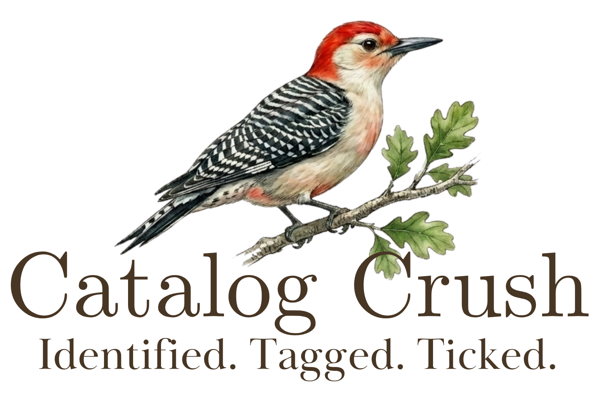

# Crush Catalog

Crush Catalog is a plugin for Lightroom Classic and eBird to identify birds in your photos.

## License

Copyright 2026 Jason Dentler

Licensed under the Apache License, Version 2.0 (the "License");
you may not use this file except in compliance with the License.
You may obtain a copy of the License at

   http://www.apache.org/licenses/LICENSE-2.0

Unless required by applicable law or agreed to in writing, software
distributed under the License is distributed on an "AS IS" BASIS,
WITHOUT WARRANTIES OR CONDITIONS OF ANY KIND, either express or implied.
See the License for the specific language governing permissions and
limitations under the License.

## Credits and Third-Party Software

Sample images are not included in the Apache 2.0 license. See NOTICE.txt for terms.

This project incorporates the following third-party library:

* **[JSON.lua](http://regex.info)** by Jeffrey Friedl.
  * **License:** [Creative Commons Attribution 3.0 (CC-BY 3.0)](http://creativecommons.org)
  * **Compliance:** The original copyright notice, web-page links, and `AUTHOR_NOTE` string are maintained within the source file located at `crush-catalog.lrplugin/lib/JSON.lua`.

---
*This plugin is not affiliated with or endorsed by Adobe, Cornell University, or eBird.*
